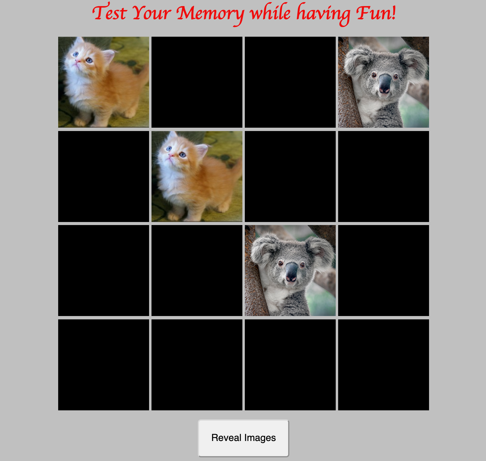
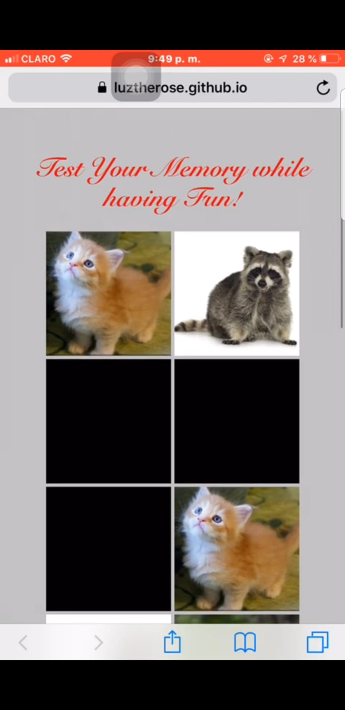

# matchUp

**matchUp** is a game to challenge your memory while having fun. This game will give you the opportunity to prove your memory in order for you to win the game, you'll need to pair up the images in record time. 

---
### Rules of the Game

The idea of the game is to pair up the images in the least amount of time ever. When you open the game, then on the screen will be displayed the images but the will be hidden, when you click on one of the images that image will be revealed and then you need to click on another image to find the one that is pair to the image that you uncovered. 

If the images are equaled both images will be remained open, however, if they do not pair up both images will get covered up and will need to click on another one but keeping in mind the previous images and the positions where they are located. 

#### Toggle Button

If for any reason, you couldn't complete the game but still want to reveal the images, there is a ***Reveal Images*** button at bottom of the page. On click, you can show all the images and you can use the button now called ***Hide Images*** to cover up the images. 

---

### Link & Demo

Have fun, try *mathUp*, and Relax!

[matchUP](https://luztherose.github.io/matchUp/. "A game to test your memory")

A better view of ***matchUp***. A game to keep your mind active!

**YouTube**
[matchUp Demo](https://youtu.be/eRsY9_1e59Y)
